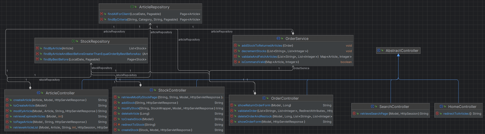
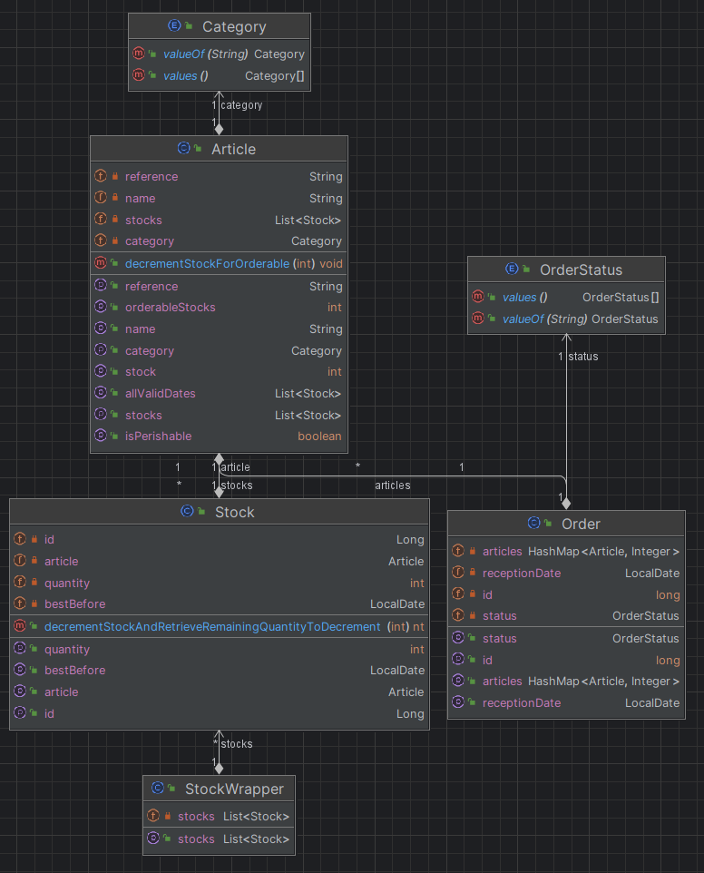

# Référencement

Projet réalisé dans le cadre de mon Master Informatique.

Technologies utilisées :

* Java,
* Springboot,
* Thymeleaf,
* H2,
* JUnit

## Description du sujet

User stories présentes dans [US.md](./US.md).

Nous avons travaillé sur la partie référencement d'un *mock* de site de vente en ligne.
Cette partie s'occupe des articles, des stocks et des commandes, répartis autour de trois rôles : admin, employé et client.

Fonctionnalités d'administrateur :
- Faire une recherche d'article par référence ou catégorie
- Créer et modifier des articles
- Ajouter et modifier des lots
- Voir et supprimer rapidement tous les produits périmés

Fonctionnalité d'employé :
- Pouvoir remettre en stock une commande retournée

Fonctionnalité client :
- Afficher les produits en stock et dont la DLC est dans plus de 5 jours.

## Procédure d'installation et d'initialisation

### Exécution du programme

Pour démarrer le programme, il suffit d'exécuter la commande :

```sh
mvn spring-boot:run
```

### Le site

Pour accéder à la page de recherche (la page d'accueil), il suffit de suivre l'URL : [accueil](http://localhost:8080).
À partir de cette page, toutes les autres pages sont accessibles **SAUF** les retours de commandes.


Pour retourner les commandes, il faut accéder aux liens suivants :
* [/mock-order/1](http://localhost:8080/mock-order/1) : commande acceptée par le client, c'est-à-dire qu'il l'a reçu et ne souhaite pas la retourner.
* [/mock-order/2](http://localhost:8080/mock-order/2) : commande retournée par le client, qui date de plus de 7 jours. Elle ne pourra plus être retournée à cause du délai.
* [/mock-order/3](http://localhost:8080/mock-order/3) : commande qui est retournée par le client et qui a une date dans le délai de retour autorisé. La liste des articles de la commande seront restockés informatiquement, excepté les articles périssables. La commande devrait être supprimée, mais c'est un mock.

## Choix particuliers

### Base de données

Nous avons utilisé une base de données `h2` automatiquement montée par Spring.
Elle contient simplement les articles et les stocks associés.
Voir [data.sql](src/main/resources/data.sql) au besoin, qui peuple la base de données avec quelques articles et des stocks leur correspondant au démarrage de l'application.

### Diagramme de classes




Dans notre base de données, nous avons une table pour les articles, identifiés par leur référence.
Cette table est gérée par notre `ArticleRepository`.
Nous avons également une table pour nos stocks, gérée par un `StockRepository`.

Nous avons défini des `Controller` pour chaque thème principal de nos *user stories* : la fonction de recherche, la gestion
des articles, la gestion des stocks, et la gestion des commandes. Nous avons également défini un `HomeController` qui redirige
le chemin racine du site directement vers la page de recherche d'articles.

Chaque contrôleur manipule des requêtes HTTP GET ou POST et renvoie vers des vues définies dans `resources/templates/`.
La gestion des commandes nécessitant un ensemble de logiques plus complexes, nous les avons séparées dans un `OrderService`.

Nous avons également défini un gestionnaire d'erreur global `GlobalExceptionHandler` qui renvoie vers une vue dédiée à l'affichage des
erreurs non gérées par les contrôleurs, ainsi que quelques exceptions personnalisées liées à un article inexistant, une commande invalide,
ou un statut de commande qui en rend le retour impossible par le client.

### Thymeleaf

Pour simplifier au maximum l'écriture du front,
nous avons décidé d'utiliser Thymeleaf qui gère les templates/view (vues) comme le ferait JSP pour un rendu
facile à implémenter et lisible.
Cet outil nous a permis de gérer facilement les formulaires et les objets qu'ils créent ou modifient.

Nous avons remarqué des duplications de code dans nos `.html`.
Grâce à Thymeleaf, nous avons pu créer un unique fragment dans un fichier contenant une fois le code à factoriser.

```html
<form th:fragment="formulaire (action, article, isCreate)" th:action="${action}" th:object="${article}" method="post">
        [...]
</form>
```

```html
<div th:replace="~{article_form :: formulaire (@{/articles/{reference}(reference=${article.reference})}, ${article}, false)}"></div>
```

### Rôles

Nous n'avons pas géré les rôles, nous avons simplement rajouté un *query param role* là où nous en avions besoin.
Cela nous permet de simuler les comportements attendus pour chacun des rôles impliqués dans les différentes *user stories*.
Nous sommes donc en rôle admin par défaut.

```url
http://localhost:8080/articles?role=client
```

### Gestion des commandes

Une vue `mock-order` permet de simuler le panier d'un client et d'ajuster les quantités des différents articles prédéfinis avant de tenter de valider la commande.
La base de données est alors interrogée pour vérifier que les articles demandés sont en stock et dans des quantités suffisantes avec des dates de péremption valides.
Si au moins une partie de la commande ne peut être validée, la commande complète est impossible et un message d'erreur descriptif est affiché pour le client.

### Gestion du retour de commande

Il est possible de voir l'état d'une commande grâce à son numéro sur la vue `return-order`.
La commande peut être : acceptée, ou retournée par le client.
Cette page permet de retourner informatiquement une commande, et restocker les articles correspondants.


Si un article est périssable, il sera automatiquement détruit et non restocké.
La commande contient une date de reception, et si celle-ci est supérieur à 7 jours, une erreur sera affichée à l'écran.
Une autre erreur est affichée si la commande est acceptée par le client, mais qu'un administrateur essaye de restocker ces articles.
En effet, on ne peut retourner une commande acceptée.  

### Gestion des saisies incorrectes

Nous avons énormément de formulaire donc beaucoup de champ de saisie.
Il peut ainsi arriver que les informations saisies pour créer ou modifier une ressource soit incorrect.
Dans ces cas-là, on annule la saisie et on affiche ce qui a mal été saisie tout en restant sur la page pour pouvoir saisir à nouveau les informations.

```html
<h2 th:if="${error}" th:text="${error}"></h2>
```

### Gestion des erreurs

Dans les cas de figures pertinents, nous avons décidé d'afficher les erreurs sur la vue courante en ajustant le statut de la réponse HTTP.
C'est notamment le cas dans la plupart des gestions d'erreur autour des entrées fournies par l'utilisateur dans les formulaires (de création ou modification d'article ou de stock).
Auxquels cas, il nous a semblé pertinent d'afficher directement ce qui, dans les entrées fournies, avait pu provoquer l'erreur (un article inexistant par exemple) et laisser l'opportunité à l'utilisateur de modifier directement sa requête.

Dans d'autres cas, toute erreur sera gérée par un `ControllerAdvice` et son `ExceptionHandler`.
Ce gestionnaire d'erreur renvoie toute erreur non gérée explicitement sur une vue dédiée à l'affichage des erreurs avec le message associé à l'erreur passée en paramètre. Cela évite d'avoir une page d'erreur générique peu descriptive pour toute erreur non prévue par notre application.

```java
@ControllerAdvice
public class GlobalExceptionHandler {
// Redirige chaque exception non gérée vers la page d'erreur depuis n'importe quel contrôleur
@ExceptionHandler(Exception.class)
public String handleException(Exception exception, Model model) {
    model.addAttribute("error", exception.getMessage());
    return "error";
  }
}
```
